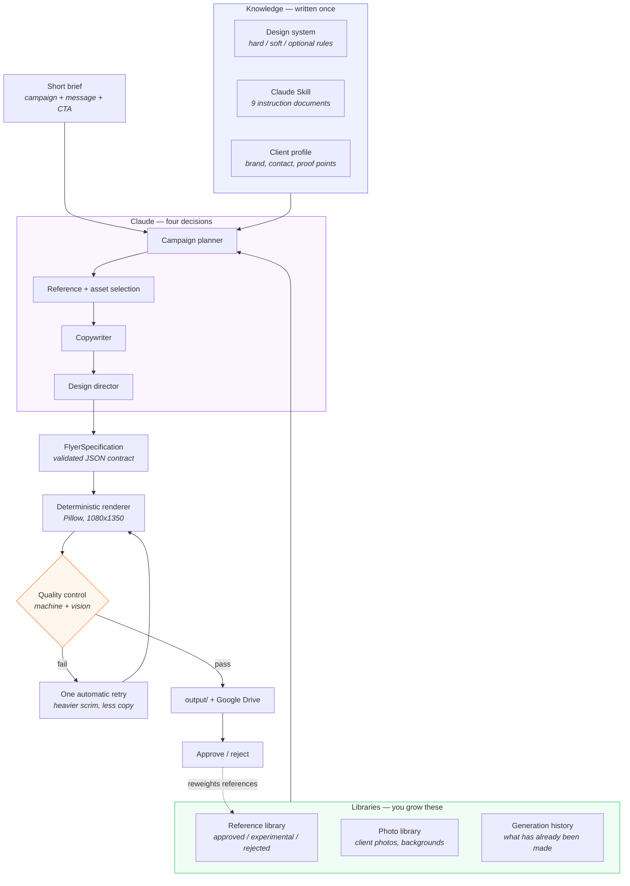
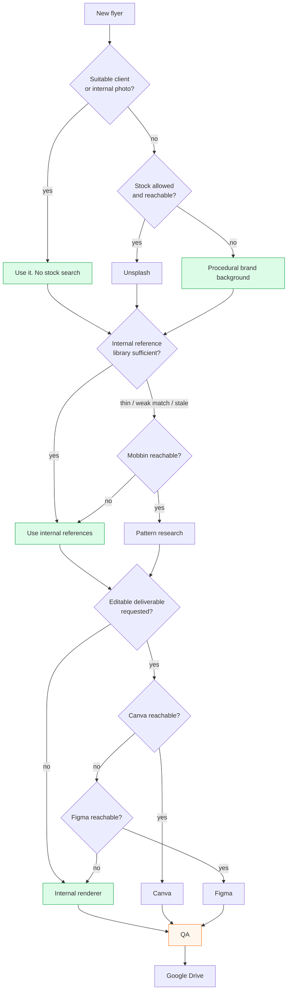
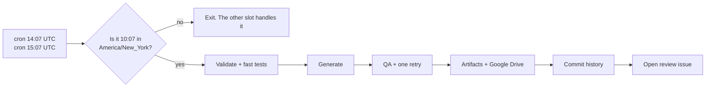

<div align="center">

# Flyer Generator

**AI-powered construction marketing automation.**
Two original, brand-accurate social flyers every weekday, from a four-line brief.

[](https://github.com/engineeringwithjp/flyer-generator/actions/workflows/tests.yml)
[](https://github.com/engineeringwithjp/flyer-generator/actions/workflows/generate-flyers.yml)
[](https://www.python.org/)
[](https://www.anthropic.com/)
[](https://docs.astral.sh/ruff/)
[](https://mypy-lang.org/)
[](LICENSE)

`Claude decides what to say · a deterministic renderer decides how it looks · QA decides what ships`

</div>

---

## The problem this solves

Producing marketing for a construction client means re-explaining the same
things every single time: the house is the hero, keep it to 4:5, minimal copy,
use the brand maroon as an accent not a fill, don't let the manufacturer brand
take over, don't make it look AI-generated, don't invent a warranty.

That knowledge is written down **once** here. A flyer request then only carries
what is different about that flyer.

<table>
<tr><th width="50%">Before</th><th width="50%">After</th></tr>
<tr valign="top"><td>

```
A 600-word Master Image-Generation Brief,
pasted in full, every time:

  aesthetic, composition, typography,
  image treatment, house preservation,
  branding, marketing principles,
  text density, icon usage, colour,
  dimensions, what looks professional,
  what looks AI-made, what never to do
  ...then the actual request
```

</td><td>

```
CLIENT:   all-elite
CAMPAIGN: siding
MESSAGE:  built-in insulation
CTA:      Free Estimate
```

Everything else comes from the Skill,
the design system and the client profile.

</td></tr>
</table>

```bash
flyer generate --campaign siding --message "built-in insulation" --cta "Free Estimate"
```

---

## How it works



**The separation of concerns that makes it reliable:** Claude never draws
anything. It emits a validated `FlyerSpecification`, and a deterministic
renderer turns that into pixels. The same spec always produces the same image,
so a good flyer can be reproduced and a bad one can be diagnosed.

---

## Status

Honest labels. Nothing below is claimed as working unless it has been run.

| | Capability | Notes |
|:--|:--|:--|
| ✅ | **Two flyers from a four-line brief** | 6 layouts, 5 type pairings, 1080x1350 |
| ✅ | **Design system as machine-readable rules** | 60+ rules, classified hard / soft / optional |
| ✅ | **Deterministic renderer** | Pillow. Same spec → identical pixels |
| ✅ | **Campaign planner with memory** | No repeated campaign within 10 days |
| ✅ | **Quality control** | 20+ machine checks. Em dashes, emoji, AI filler, fabricated numbers, unauthorised offers, blank renders |
| ✅ | **Anti-AI-tell gate** | Em/en dashes and emoji are hard failures |
| ✅ | **Reference library with scored selection** | Approved > experimental; rejected never selected |
| ✅ | **Approval feedback loop** | Approvals reweight the references that produced them |
| ✅ | **Connector decision engine** | Chooses when *not* to call an external tool, and records why |
| ✅ | **Multi-client** | A new contractor is a folder and a JSON file |
| ✅ | **Test suite** | 260 tests, ruff clean, mypy clean, no network in unit tests |
| ✅ | **GitHub Actions** | 6 workflows: generate, tests, ingest, approval, gallery, distil |
| ⚙️ | **Claude integration** | Code complete and mocked-tested. Needs `ANTHROPIC_API_KEY` |
| ⚙️ | **Google Drive upload** | Code complete and mocked-tested. Needs OAuth secrets. Target folder verified |
| ⚙️ | **Reference ingestion** | Code complete and mocked-tested. Needs `ANTHROPIC_API_KEY` |
| ⚙️ | **Prompt-to-Skill distillation** | Built. Needs a corpus in `design-system/historical-prompts/` |
| 🔌 | **Unsplash / Figma / Canva** | Adapters + fallbacks implemented. **Never called.** Need tokens |
| 🔌 | **Mobbin** | Interface + fallback implemented. No adapter reachable in this environment |
| 🧪 | **GitHub Pages gallery** | Built, not yet deployed |
| 📋 | Social publishing, A/B testing, web dashboard | Interfaces left clean. Not built |

✅ working · ⚙️ needs configuration · 🔌 connector not verified · 🧪 experimental · 📋 planned

---

## Quick start

```bash
git clone https://github.com/engineeringwithjp/flyer-generator.git
cd flyer-generator
make install     # venv + dependencies + brand fonts
make preview     # two flyers, no API key, no upload
```

Look in `output/<today>/all-elite/`. That works with **no credentials and no
photographs** — the renderer falls back to procedural brand backgrounds and a
deliberately conservative copywriter that cannot make a claim.

Then turn on Claude:

```bash
cp .env.example .env      # add ANTHROPIC_API_KEY
flyer generate --count 2 --no-upload
```

New to this? **[GETTING-STARTED.md](GETTING-STARTED.md)** walks through it with no assumptions.

Full walkthrough: **[docs/SETUP.md](docs/SETUP.md)** ·
How to verify it: **[docs/TESTING.md](docs/TESTING.md)**

---

## The daily workflow

<table>
<tr><td width="33%" valign="top">

### You find a flyer you like

Drop it in `references/inbox/` and push.

Claude analyses the design DNA — composition, hierarchy, type, treatment, CTA
placement — files it under `experimental/`, and opens a PR.

You promote what you like:

```bash
flyer promote ref_000001 approved
```

</td><td width="33%" valign="top">

### 10:07 AM, every weekday

GitHub Actions runs the pipeline. Two flyers land in Google Drive under
`Flyers/2026/September/09-05/`.

A review issue opens with the headlines, campaigns and QA scores.

Nothing that fails QA is uploaded.

</td><td width="33%" valign="top">

### You review

Comment on the issue:

```
approve run_2026-09-05_ab12cd_01
reject  run_2026-09-05_ab12cd_02 too much text
```

Approvals raise the score of the references that produced them. Rejections
lower it. The system gets closer to your taste.

</td></tr>
</table>

---

## The design system

The answer to "stop making me repeat myself". Rules live in
`design-system/principles/principles.json`, are classified, and are compiled
into the system prompt of every Claude call.

| Class | Meaning |
|:--|:--|
| `hard` | Follow essentially every time. A violation is a QA error |
| `soft` | Follow by default. May be broken when composition benefits, with a stated reason |
| `optional` | A technique for appropriate campaigns. Never universal |

<details>
<summary><b>The rules that shape every flyer</b></summary>

**Global** — property-first composition · one idea per flyer · understood in
1–2 seconds · 1080x1350 · nothing against an edge · low information density ·
never repeat information · never add text because space exists · vary across
the week

**Photography** — the house is the hero · preserve architecture, roofline,
windows, proportions, landscaping, driveway, perspective · photorealistic
Northeast suburban · natural daylight · adapt by cropping and scrim, never by
redesigning the property · verify contrast before placing text

**Typography** — four levels only · at most two families · the headline must
survive being scaled to 180px · no paragraphs · no microscopic text · clear
size steps

**Colour** — the brand colour is punctuation, not paint · let the property's
palette lead · 4.5:1 contrast floor · one accent

**Branding** — the client is the advertiser · manufacturer products are
material options, never the advertising brand · contact details byte-for-byte
from `client.json`

**Product presentation** — show the benefit; a construction feature that can be
demonstrated visually must not be explained in paragraphs

**The NEVER list** — excessive text · huge banners · repetitive card grids ·
corporate infographic layouts · template symmetry · over-design · fake-looking
houses · impossible roof geometry · inaccurate construction detail · excessive
HDR · gradient soup · brand-colour floods · decorative icons · manufacturer
brands leading · anything that reads as a Canva template · em dashes · emoji ·
invented claims of any kind

</details>

<details>
<summary><b>Composition archetypes</b></summary>

| Archetype | Use case | Layout | Density |
|:--|:--|:--|:--|
| `hero-image` | Brand, premium, full replacement | `hero-full` | low |
| `split-image` | Standard service promotion (the workhorse) | `banner-lower-third` | medium |
| `editorial-overlay` | Trust, licensing, credibility | `stat-stack` | medium |
| `architectural-detail` | Material quality, workmanship | `hero-full` | low |
| `before-after` | Proof of work | `before-after` | low |
| `product-education` | Manufacturer products, assemblies | `hero-full` | low |
| `promotional` | Authorised offers only | `offer-badge` | medium |
| `seasonal` | Timing-driven campaigns | `split-diagonal` | medium |
| `storm-emergency` | Storm damage, emergency response | `offer-badge` | medium |

</details>

<details>
<summary><b>Why the flyers don't all look the same</b></summary>

Two flyers a weekday is ~500 a year. The failure mode is not one bad flyer, it
is 500 identical ones. The system varies deliberately:

- **6 layouts**, never the same one twice in a batch or two days running
- **5 type pairings** — condensed editorial, impact promotional, grotesque
  corporate, serif editorial, condensed industrial
- **Campaign rotation** — no repeat within 10 days, enforced from history
- **Angle pairing** — a demand-capture flyer alongside a trust flyer
- **Overlay, crop, alignment and CTA** chosen per flyer by the design director
- **Recency penalties** on both photographs and references

</details>

---

## Connected design ecosystem

Canva, Figma, Unsplash and Mobbin are **supplemental**. The decision engine's
bias is toward doing nothing: an external call has to beat what the repository
already has.



| Tool | Role | Used when | Never used when | Fallback |
|:--|:--|:--|:--|:--|
| **Unsplash** | Asset | No client photo, no internal background, and the campaign needs a photograph | A suitable internal image exists | Approved internal backgrounds, then a procedural brand background |
| **Mobbin** | Reference | The internal library is thin, matches poorly, or the direction has gone stale | An approved internal reference already scores well | The internal reference library, then design-system defaults |
| **Figma** | Template | Building or revising the master layout system | A routine daily flyer | The local design system and the internal renderer |
| **Canva** | Production | The client asked for an editable file | Deterministic rendering already produces the deliverable | The internal renderer (a PNG, not an editable file) |

**Source priority.** Client photos → approved internal work → the design system
→ the reference library → Figma / Canva / Mobbin → Unsplash.

**Every decision is recorded**, including the ones not to call anything:

```bash
$ flyer decide
Decision  Internal sources only: A suitable internal photograph exists, so no
          stock search.; The internal reference library is sufficient
          (5 references, best score 0.80).

  skipped unsplash: a suitable client or internal photograph already exists
  skipped mobbin:   the internal reference library already covers this campaign
  skipped canva:    deterministic rendering already produces the deliverable
  skipped figma:    no template work is required for a routine daily flyer
```

You can still override in plain language:

```bash
flyer generate --tools "use canva"
flyer generate --tools "no stock photography"
flyer generate --tools "internal assets only"
```

```bash
$ flyer connectors     # what is actually reachable right now
```

> **Verified status:** none of the four has been called from this repository.
> The adapters, decision engine, provenance model and every fallback path are
> implemented and tested; the live calls require tokens that are not configured.
> With all four absent — the default — the system runs entirely on internal
> sources.

---

## Repository layout

```
flyer-generator/
├── .claude/skills/construction-flyer/   The creative instruction layer
│   ├── SKILL.md                         Entry point, loaded by every stage
│   ├── design-rules.md                  Hierarchy, archetypes, overlay calibration
│   ├── photography-rules.md             The house is the hero
│   ├── branding-rules.md                Client vs manufacturer
│   ├── copywriting-rules.md             Voice, budgets, banned language
│   ├── asset-selection.md               Photo and reference scoring
│   ├── reference-analysis.md            Reading a reference without copying it
│   ├── quality-control.md               The review checklist
│   ├── negative-rules.md                The NEVER list
│   └── construction-marketing.md        Trade, customer, seasonality
│
├── design-system/                       Machine-readable knowledge
│   ├── principles/principles.json       Classified rules + archetypes
│   ├── preferences/preferences.json     Declared and learned preferences
│   ├── patterns/successful-patterns.json
│   ├── failures/failed-patterns.json    The NEVER list, structured
│   ├── historical-prompts/              Prompt-to-Skill corpus
│   ├── proposals/                       Distillation output (review, don't auto-apply)
│   └── CONFLICTS.md                     Contradictions, resolved explicitly
│
├── app/
│   ├── ai/          claude_client · campaign_planner · copywriter
│   │                design_director · qa_agent · reference_analyzer
│   │                prompt_distiller · skill
│   ├── assets/      catalog · selector · image_utils · metadata
│   ├── clients/     loader · validator
│   ├── connectors/  base · adapters · registry · policy
│   ├── rendering/   renderer · templates · typography · composition · export
│   ├── drive/       auth · uploader · folders
│   ├── pipeline/    generate · ingest · validate · history
│   ├── models/      Pydantic contracts between every layer
│   └── cli.py
│
├── config/          campaigns · layouts · typography · scoring · connectors
├── clients/         all-elite/ · _template/
├── references/      inbox · approved · experimental · rejected
├── assets/          Shared photography, by service
├── data/            Indexes and generation history
├── tests/           260 tests
└── .github/         6 workflows + composite setup action
```

---

## CLI

```bash
flyer generate --client all-elite --count 2
flyer generate --campaign siding --message "built-in insulation" --cta "Free Estimate"
flyer generate --tools "internal only" --no-upload

flyer ingest-reference references/inbox/nice-ad.jpg
flyer promote ref_000001 approved
flyer list-references --status approved

flyer feedback run_2026-09-05_ab12cd_01 reject --reason "headline too small"
flyer history --limit 20

flyer validate          # configuration, clients, libraries, fonts
flyer connectors        # what external tools are reachable
flyer decide            # dry-run the connector decision engine
flyer design-system     # inspect the compiled rules
flyer layouts           # the six layouts
flyer catalog           # rebuild the photo index
flyer distill           # Prompt-to-Skill
flyer gallery           # build the static review gallery
```

---

## Adding things

<details>
<summary><b>A reference flyer you found online</b></summary>

```bash
cp ~/Downloads/nice-roofing-ad.jpg references/inbox/
git add references/inbox && git commit -m "feat(references): add a roofing reference" && git push
```

The ingest workflow analyses it, files it under `experimental/`, and opens a PR
with the extracted metadata. Promote what you like with
`flyer promote ref_000001 approved`.

Locally: `flyer ingest-reference`.

</details>

<details>
<summary><b>Client photography</b></summary>

```
clients/all-elite/assets/approved/roofing-shingle-replacement-01.jpg
clients/all-elite/assets/approved/siding-colonial-white-02.jpg
```

Name files by service and they are tagged automatically. Client-owned photos
outrank the shared library by 1.25x in selection, so they get used first.

Then `flyer catalog`.

</details>

<details>
<summary><b>Another construction client</b></summary>

```bash
cp -r clients/_template clients/second-co
# edit clients/second-co/client.json
flyer validate
flyer generate --client second-co --count 2
```

No code changes. There is a test that asserts exactly this
(`test_adding_a_client_needs_no_code_change`).

</details>

<details>
<summary><b>A new layout</b></summary>

1. Entry in `config/layouts.json`
2. Builder in `app/rendering/templates.py`, registered in `LAYOUT_BUILDERS`
3. Map it to an archetype in `principles.json`

A test fails until config and code agree, and the parametrised render tests
pick it up automatically.

</details>

---

## The 10:07 automation



GitHub Actions cron is UTC only, so 10:07 Eastern is two different UTC times
across the year. Both slots fire and `flyer schedule-check` decides which one is
really 10:07 locally; the other exits in seconds.

**Manual runs use the same pipeline** — Actions → Generate flyers → Run
workflow, with inputs for client, count, campaign, message, CTA and connector
overrides. There is deliberately only one generation implementation.

| Workflow | Trigger | Does |
|:--|:--|:--|
| `generate-flyers` | 10:07 ET weekdays, or manual | The daily run |
| `tests` | Push, PR | ruff, mypy, pytest on 3.12 and 3.13, plus an end-to-end smoke render |
| `ingest-reference` | Push to `references/inbox/**` | Analyses and files, opens a PR |
| `approval` | Comment on a review issue | Records approve/reject into history |
| `gallery` | After a successful run | Builds the static review gallery |
| `distill` | Push to the prompt corpus, or manual | Proposes design-system rules |

---

## Quality control

Two passes. Nothing that fails is uploaded.

**Deterministic** — no API, runs in CI, gates every upload:

dimensions · file integrity · blank-render detection · edge clipping ·
placeholder text · duplicate words · **em dashes** · **emoji** · AI filler
phrases · text volume · fabricated numbers · unauthorised offers · risky
insurance claims · phone-number format · client mismatch

**Vision** — Claude looks at the rendered PNG:

thumbnail readability · contrast · clipping and overlap · campaign relevance ·
photographic realism · brand accuracy · manufacturer subordination · and the
**human design test**: *does this look like a professional designer made it, or
like a Canva template?*

On failure the pipeline regenerates once with a heavier scrim and less copy,
then keeps whichever attempt scored higher.

---

## Troubleshooting

<details>
<summary><b>Flyers look plain / the copy is generic</b></summary>

`ANTHROPIC_API_KEY` is not set, so the deterministic fallback writer is running.
It is deliberately conservative because it is forbidden from making any claim
that is not in `client.json`. Set the key.

Check with `flyer validate` — it reports `claude_enabled`.

</details>

<details>
<summary><b>Flyers have a plain gradient instead of a photo</b></summary>

The photo library is empty. That is a supported state, not a bug — a clean
brand gradient beats a mismatched photo.

Add photos under `clients/<slug>/assets/approved/` or `assets/<service>/`, then
`flyer catalog`. For development only:
`python scripts/generate_placeholder_assets.py`.

</details>

<details>
<summary><b>The typography looks wrong</b></summary>

Fonts are gitignored. Run `python scripts/fetch_fonts.py`. Without them the
renderer falls back to system fonts, which works but looks less polished.

</details>

<details>
<summary><b>Nothing uploaded to Drive</b></summary>

`flyer validate` reports `drive_enabled`. You need all of
`GOOGLE_CLIENT_ID`, `GOOGLE_CLIENT_SECRET`, `GOOGLE_REFRESH_TOKEN` and
`GOOGLE_DRIVE_ROOT_FOLDER_ID`.

Note that flyers failing QA are **never** uploaded — that is intentional.

</details>

<details>
<summary><b>The scheduled run didn't fire</b></summary>

GitHub delays scheduled workflows under load, sometimes by 10–30 minutes, which
is why the target is 10:07 rather than 10:00. Scheduled workflows are also
disabled automatically after 60 days of repository inactivity.

Check Actions → Generate flyers for a skipped run: the wrong UTC slot exits on
purpose.

</details>

<details>
<summary><b>A flyer keeps failing QA</b></summary>

The metadata sidecar next to the PNG lists every issue with its severity. The
usual causes are an under-darkened overlay on a bright photo, or copy that
tripped the anti-AI-tell gate (an em dash is a hard failure).

</details>

---

## Roadmap

| | |
|:--|:--|
| Next | Live connector verification · GitHub Pages gallery deploy · richer before/after with real project pairs |
| Later | Social scheduling (Meta, Google Business) · engagement feedback into reference scoring · A/B headline testing |
| Eventually | Web dashboard · client approval portal · cloud object storage for large libraries |

Interfaces are kept clean for these. None of them are built.

---

## Documentation

| | |
|:--|:--|
| **[GETTING-STARTED.md](GETTING-STARTED.md)** | **Never used a terminal? Start here** |
| [docs/SETUP.md](docs/SETUP.md) | Local → Claude → full automation |
| [docs/TESTING.md](docs/TESTING.md) | Four levels of verification |
| [docs/VERSIONING.md](docs/VERSIONING.md) | Tags, branches and rollback |
| [CONTRIBUTING.md](CONTRIBUTING.md) | Conventions and where things live |
| [SECURITY.md](SECURITY.md) | Secrets and privacy assumptions |
| [design-system/CONFLICTS.md](design-system/CONFLICTS.md) | Contradictions, resolved explicitly |

---

<div align="center">

**MIT** · Built for New Jersey residential contractors

*You manage the taste. Claude manages the repetitive production.*

</div>
