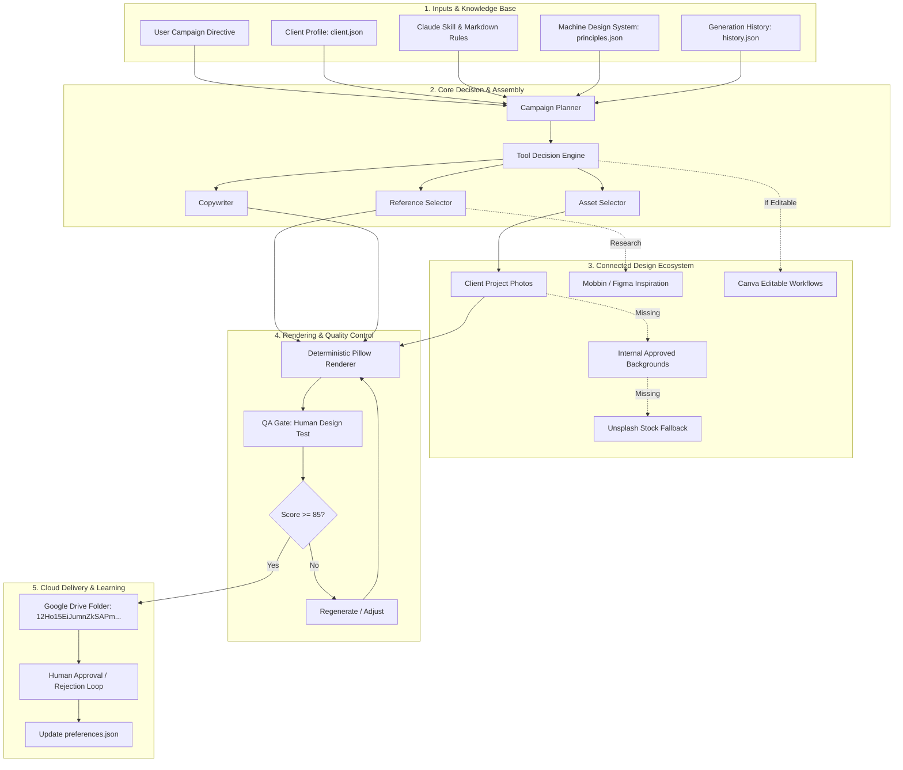
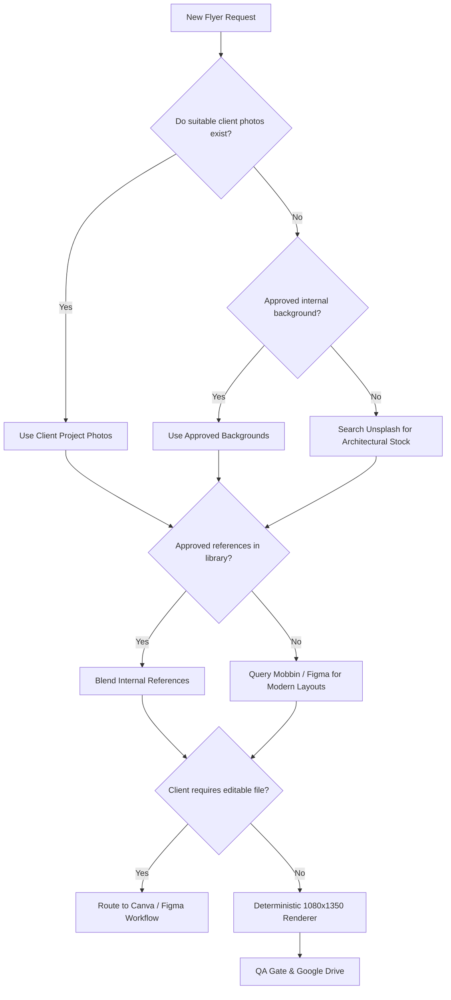

# Flyer Generator 🏗️📐

[](https://github.com/engineeringwithjp/flyer-generator/actions/workflows/generate-flyers.yml)
[](https://www.python.org/downloads/)
[](https://github.com/astral-sh/ruff)
[](#system-architecture)
[](LICENSE)

> **Autonomous AI construction marketing production system** powered by Claude, standardized design rules, client assets, deterministic 1080×1350 rendering, and daily scheduled cloud delivery.

---

## 🌟 Table of Contents
- [1. Executive Summary](#1-executive-summary)
- [2. The Primary Problem Solved: Prompt Minimization](#2-the-primary-problem-solved-prompt-minimization)
- [3. System Architecture](#3-system-architecture)
- [4. Connected Design Ecosystem (Canva + Figma + Unsplash + Mobbin)](#4-connected-design-ecosystem)
- [5. Standardized Design System & Rules](#5-standardized-design-system--rules)
- [6. Composition Archetypes](#6-composition-archetypes)
- [7. Directory Structure](#7-directory-structure)
- [8. Quickstart & Local Execution](#8-quickstart--local-execution)
- [9. Unified CLI Reference (`flyer_cli.py`)](#9-unified-cli-reference-flyer_clipy)
- [10. Google Drive Cloud Delivery](#10-google-drive-cloud-delivery)
- [11. GitHub Actions 10:07 AM Daily Scheduler](#11-github-actions-1007-am-daily-scheduler)
- [12. Multi-Contractor Scaling Guide](#12-multi-contractor-scaling-guide)
- [13. Quality Control & The Human Design Test](#13-quality-control--the-human-design-test)
- [14. Component Status & Secrets Guide](#14-component-status--secrets-guide)

---

## 1. Executive Summary
**Flyer Generator** is not a generic image generator or a single bloated prompt. It is a full-stack **construction marketing automation agent** built specifically for residential exterior contractors (roofing, siding, gutters, windows, and emergency storm restoration), defaulting to **All Elite Construction Corp.** in Northern New Jersey.

### What it produces:
- **Two high-converting 1080×1350 (4:5) social media flyers per day**.
- **Real Property First**: Treats real property photos as sacred; preserves authentic architecture, rooflines, and landscaping.
- **Agency-Level Human Aesthetic**: Eliminates "AI sludge"—zero em dashes (`—`), zero cheesy emojis (`🔥`, `🚀`), zero fabricated warranties or discounts, and disciplined `#80272B` brand accenting.
- **Automated Delivery**: Uploads directly to your Google Drive (`12Ho15EiJumnZkSAPm0I1Zd9Vwe6CuLiT`) every weekday at 10:07 AM Eastern.

---

## 2. The Primary Problem Solved: Prompt Minimization

### ❌ The Old Way (Repetitive 800-Word Brief Every Time)
Before this system, generating a single flyer required constantly re-explaining:
> *"Remember the house is the hero. Remember 4:5 ratio (1080x1350). Remember All Elite's accent is #80272B. Don't use em dashes. Don't use emojis. Preserve the roofline. Put the phone number at the bottom. Make sure the headline has high contrast against the sky. Don't invent fake 50% discounts..."*

### ✅ The New Way (The 4-Line Prompt)
Because all brand standards, photography rules, typography scales, and negative constraints are permanently encoded into the Claude Skill and machine-readable design system, generating today's flyer now requires only:

```text
Client: All Elite
Campaign: Composite Siding
Focus: Built-in insulation
CTA: Free Estimate
```

**The system automatically resolves everything else:**
```
USER INPUT (4 Lines)
    ↓
CLIENT PROFILE (All Elite brand colors, phone, approved claims)
    ↓
GLOBAL DESIGN SYSTEM (Hierarchy, safe margins, typography scale)
    ↓
CAMPAIGN RULES (Siding product education, continuous thermal barrier)
    ↓
REFERENCE LIBRARY (Matches approved reference ref_siding_001)
    ↓
ASSET LIBRARY (Pulls verified client siding project photo)
    ↓
GENERATION HISTORY (Verifies no recent duplicate headlines)
    ↓
CLAUDE AGENT & COPYWRITER (Zero em dashes, zero emojis, verified claims)
    ↓
FLYER SPECIFICATION (Structured JSON definition)
    ↓
DETERMINISTIC RENDERER (Pixel-perfect 1080x1350 PNG)
    ↓
QA GATE (Human Design Test >= 85/100)
    ↓
GOOGLE DRIVE (Uploaded to folder 12Ho15EiJumnZkSAPm0I1Zd9Vwe6CuLiT)
```

---

## 3. System Architecture



---

## 4. Connected Design Ecosystem

The system integrates with **Canva**, **Figma**, **Unsplash**, and **Mobbin** as **supporting tools**. They never replace the deterministic core pipeline or create points of failure.

### Strict Sourcing & Tool Priority:
```
1. Client-Provided Project Photography (Highest Priority)
       ↓
2. Internal Design System & Approved Rules
       ↓
3. Approved Reference Library
       ↓
4. Connected Design Tools (Figma / Mobbin / Canva)
       ↓
5. Supplemental Stock Photography (Unsplash Fallback Only)
```

### Automatic Decision Engine:


### Connector Status Matrix:
| Connector | Role & When Used | Fallback Behavior | Status |
| :--- | :--- | :--- | :--- |
| **Canva** | Used when an editable client deliverable is requested (`--force-canva`). | Uses deterministic internal renderer. | `INTEGRATED & FALLBACK READY` |
| **Figma** | Master design tokens, component frames, and layout review. | Uses local `data/design-system/principles.json`. | `INTEGRATED & FALLBACK READY` |
| **Unsplash** | Supplemental exterior photography **only** when client & internal photos are missing. | Uses internal background archive or photorealistic synthesis. | `INTEGRATED & FALLBACK READY` |
| **Mobbin** | Visual pattern discovery, spacing inspiration, and modern hierarchy. | Uses approved references in `references/approved/`. | `INTEGRATED & FALLBACK READY` |

---

## 5. Standardized Design System & Rules

The rules extracted from historical prompts are organized into modular, maintainable markdown documents inside `.claude/skills/construction-flyer/`:

- **[`SKILL.md`](.claude/skills/construction-flyer/SKILL.md)**: Main skill orchestrator and pipeline logic.
- **[`design-rules.md`](.claude/skills/construction-flyer/design-rules.md)**: 14-level design hierarchy, grid systems, safe margins, and font scales.
- **[`photography-rules.md`](.claude/skills/construction-flyer/photography-rules.md)**: **The House is the Hero** standard. Preservation of real rooflines, windows, siding courses, landscaping, and perspective.
- **[`copywriting-rules.md`](.claude/skills/construction-flyer/copywriting-rules.md)**: Homeowner benefit copy. Strict anti-fabrication rules (no fake warranties, stats, or unverified claims).
- **[`branding-rules.md`](.claude/skills/construction-flyer/branding-rules.md)**: All Elite `#80272B` accent allocation (10-15% max). Subordination of manufacturer brands (ASCEND® and CertainTeed® presented as material options installed by All Elite).
- **[`negative-rules.md`](.claude/skills/construction-flyer/negative-rules.md)**: Universal blacklist: **Zero em dashes (`—`)**, **Zero emojis**, no Canva template clutter, no warped AI architecture.
- **[`quality-control.md`](.claude/skills/construction-flyer/quality-control.md)**: 100-point Human Design Test audit criteria.
- **[`asset-selection.md`](.claude/skills/construction-flyer/asset-selection.md)**: Strict 5-tier photo sourcing priority.
- **[`reference-analysis.md`](.claude/skills/construction-flyer/reference-analysis.md)**: Abstraction of layout and typography without copying third-party graphics.

---

## 6. Composition Archetypes

The deterministic rendering engine supports 8 distinct architectural layouts:

| Archetype | Best For | Visual Treatment |
| :--- | :--- | :--- |
| **1. Hero Image** | Roof replacements, curb appeal | 75% full-bleed property photo, open sky headline, dark floating benefits card, bottom CTA bar. |
| **2. Editorial Overlay** | Luxury estates, architectural shingles | Cinematic full-frame photo, subtle 40% dark gradient, architectural serif/sans pairing. |
| **3. Split Image (Before/After)** | Storm damage restoration, aging roofs | Precision 50/50 comparison split with architectural "BEFORE" / "AFTER" badges. |
| **4. Architectural Detail** | Gutters, copper flashing, siding miters | Macro craftsmanship detail with callout lines highlighting engineering precision. |
| **5. Product Education** | ASCEND® Composite Foam Backed Siding | Full exterior facade paired with an inset technical cutaway showing continuous thermal foam backing. |
| **6. Promotional** | Seasonal booking incentives | Inviting suburban home with a tasteful seasonal pill tag and deadline-driven CTA. |
| **7. Seasonal Maintenance** | Fall gutter protection, pre-winter inspection | Weather-appropriate photography with a proactive 3-point homeowner prevention checklist. |
| **8. Storm / Emergency** | Wind damage, hail, sudden leaks | Dramatic sky, high visual urgency, certified inspection, and insurance claims navigation. |

---

## 7. Directory Structure

```text
flyer-generator/
├── .claude/
│   └── skills/
│       └── construction-flyer/          # Complete Claude Skill Knowledge Base
│           ├── SKILL.md
│           ├── design-rules.md
│           ├── copywriting-rules.md
│           ├── photography-rules.md
│           ├── branding-rules.md
│           ├── quality-control.md
│           ├── asset-selection.md
│           ├── reference-analysis.md
│           └── negative-rules.md
├── data/
│   └── design-system/                  # Machine-Readable Parameters
│       ├── principles.json
│       ├── successful-patterns.json
│       ├── failed-patterns.json
│       └── preferences.json            # Dynamic weights updated by feedback
├── references/                         # Design Reference Library
│   ├── inbox/                          # Drop new inspiration images here
│   ├── approved/                       # Verified high-converting references
│   │   ├── roofing/
│   │   ├── siding/
│   │   ├── gutters/
│   │   ├── windows/
│   │   └── general/
│   ├── experimental/                   # Concepts under review
│   └── rejected/                       # Anti-pattern blacklist
├── assets/                             # Photography & Graphic Assets
│   ├── backgrounds/
│   ├── construction/
│   ├── roofing/
│   ├── siding/
│   ├── gutters/
│   └── windows/
├── clients/                            # Multi-Client Contractor Profiles
│   ├── all-elite/
│   │   ├── client.json                 # Brand config, colors, phone, claims
│   │   ├── logo/
│   │   └── photos/                     # Real client project photography
│   └── client-002/
│       ├── client.json
│       ├── logo/
│       └── photos/
├── src/                                # Core Engine Source Code
│   ├── config.py
│   ├── core/                           # Pipeline & Models
│   │   ├── models.py
│   │   ├── client_manager.py
│   │   ├── campaign_planner.py
│   │   ├── asset_selector.py
│   │   ├── reference_selector.py
│   │   ├── copywriter.py
│   │   └── history_tracker.py
│   ├── connectors/                     # Connected Design Ecosystem
│   │   ├── decision_engine.py
│   │   ├── canva_connector.py
│   │   ├── figma_connector.py
│   │   ├── unsplash_connector.py
│   │   └── mobbin_connector.py
│   ├── renderer/                       # Deterministic Pillow 1080x1350 Renderer
│   │   ├── engine.py
│   │   ├── archetypes.py
│   │   ├── layout.py
│   │   └── typography.py
│   ├── qa/                             # Quality Assurance & Gates
│   │   ├── checker.py
│   │   └── human_design_test.py
│   └── services/                       # Cloud Delivery & Feedback
│       ├── google_drive.py
│       └── feedback_learner.py
├── scripts/                            # Automation & Maintenance Scripts
│   ├── generate_flyers.py
│   ├── ingest_reference.py
│   ├── feedback.py
│   ├── generate_sample_assets.py
│   └── audit_system.py
├── tests/                              # Pytest Automated Test Suite
│   ├── conftest.py
│   ├── test_client_manager.py
│   ├── test_campaign_planner.py
│   ├── test_asset_selector.py
│   ├── test_copywriter.py
│   ├── test_renderer.py
│   ├── test_qa_checker.py
│   ├── test_connectors.py
│   ├── test_google_drive.py
│   └── test_end_to_end.py
├── .github/
│   └── workflows/
│       └── generate-flyers.yml         # 10:07 AM Eastern GitHub Actions Workflow
├── output/                             # Generated Flyers & History
│   ├── history.json
│   ├── approved/
│   ├── rejected/
│   └── 2026/
├── flyer_cli.py                        # Unified CLI Entrypoint
├── pyproject.toml
├── requirements.txt
├── .env.example
└── README.md
```

---

## 8. Quickstart & Local Execution

### Prerequisites
- Python 3.11+
- Virtualenv

### 1. Clone and Set Up Virtual Environment
```bash
git clone git@github.com:engineeringwithjp/flyer-generator.git
cd flyer-generator

python3 -m venv .venv
source .venv/bin/activate
pip install -r requirements.txt
```

### 2. Generate Starter Photorealistic Assets
```bash
python flyer_cli.py sample-assets
```

### 3. Run the Master System Audit
```bash
python flyer_cli.py audit
```
*(Confirms all 28/28 system checks pass!)*

### 4. Generate Today's Two Flyers
```bash
python flyer_cli.py generate --client all-elite --count 2 --campaign "Composite Siding" --focus "Built-in insulation" --cta "Free Estimate"
```
Generated flyers are immediately saved to `output/2026/MM-DD/` and recorded in `output/history.json`.

---

## 9. Unified CLI Reference (`flyer_cli.py`)

| Command | Arguments | Description |
| :--- | :--- | :--- |
| `generate` | `--client <id>` `--count <n>` `--campaign <str>` `--focus <str>` `--cta <str>` | Executes the full 8-step generation pipeline. |
| `ingest` | *(none)* | Scans `references/inbox/`, analyzes dropped flyers, categorizes, and moves them to `references/approved/`. |
| `approve` | `--file <path>` `--archetype <str>` `--note <str>` | Marks flyer approved, saves to `output/approved/`, and increases archetype weight in `preferences.json`. |
| `reject` | `--file <path>` `--archetype <str>` `--reason <str>` | Marks flyer rejected, saves to `output/rejected/`, and penalizes archetype weight. |
| `audit` | *(none)* | Runs full Master System Audit verifying directories, rules, clients, and connectors. |
| `sample-assets` | *(none)* | Rebuilds starter high-res architectural photos and client logos. |

---

## 10. Google Drive Cloud Delivery

Target Root Folder ID: `12Ho15EiJumnZkSAPm0I1Zd9Vwe6CuLiT`  
[Open Google Drive Folder](https://drive.google.com/drive/folders/12Ho15EiJumnZkSAPm0I1Zd9Vwe6CuLiT?usp=sharing)

### Authentication Modes:
1. **Automated Server / GitHub Actions (Recommended)**: Set `GDRIVE_SERVICE_ACCOUNT_KEY` secret containing the Service Account JSON key.
2. **Local Workstation**: Place `service_account.json` in the root directory.
3. **Offline / Development Fallback**: If no Google credentials are set, the system automatically saves files locally in `output/` and logs a simulated upload so pipeline testing never crashes.

### Automatic Folder Hierarchy:
```text
Google Drive
└── 12Ho15EiJumnZkSAPm0I1Zd9Vwe6CuLiT/
    └── all-elite_composite_siding_20260905_1.png
    └── all-elite_roof_replacement_20260905_2.png
```

---

## 11. GitHub Actions 10:07 AM Daily Scheduler

The workflow in [`.github/workflows/generate-flyers.yml`](.github/workflows/generate-flyers.yml) runs:
- **Automatically**: Every Monday through Friday at **10:07 AM America/New_York** (`7 14 * * 1-5` UTC).
- **Manually (`workflow_dispatch`)**: Click "Run workflow" on GitHub and specify `client`, `count`, `campaign`, and `focus`.

### What GitHub Actions does:
1. Checks out repository.
2. Sets up Python and installs dependencies.
3. Runs Master System Audit.
4. Executes flyer generation for today's campaign.
5. Uploads generated PNGs as workflow artifacts.
6. Automatically uploads flyers to your Google Drive folder.
7. Commits updated generation history (`output/history.json`) and feedback learning (`preferences.json`) back to the repo with `[skip ci]`.

---

## 12. Multi-Contractor Scaling Guide

Adding a second construction client (e.g. `client-002`) takes 3 simple steps without touching a line of code:

### Step 1: Create Client Folder & Configuration
Create `clients/client-002/client.json`:
```json
{
  "id": "client-002",
  "company_name": "Apex Exterior Systems",
  "short_name": "Apex Exteriors",
  "phone": "(973) 555-0182",
  "service_area": "Morris County, NJ",
  "brand_colors": {
    "primary_accent": "#1E3A8A",
    "dark_neutral": "#0F172A",
    "light_neutral": "#FFFFFF"
  },
  "drive_folder_id": "12Ho15EiJumnZkSAPm0I1Zd9Vwe6CuLiT",
  "services": ["Roof Replacement", "Seamless Gutters"],
  "approved_claims": ["Licensed NJ Contractor", "Free 15-Point Inspection"]
}
```

### Step 2: Add Client Assets
- Logo: `clients/client-002/logo/logo.png`
- Photos: `clients/client-002/photos/apex_roof_001.jpg`

### Step 3: Generate Flyers for the New Client
```bash
python flyer_cli.py generate --client client-002 --count 2
```

---

## 13. Quality Control & The Human Design Test

Every flyer generated must pass the automated **Human Design Test Gate** (passing score >= 85/100):

| Audit Check | Failure Trigger | Penalty |
| :--- | :--- | :--- |
| **Zero Em Dashes** | Any presence of `—` or `--` | -25 pts (Immediate Failure) |
| **Zero Emojis** | Any marketing emoji (`🔥`, `🚀`, etc.) | -25 pts (Immediate Failure) |
| **No Fabricated Claims** | Unsupported discounts ("50% OFF") or fake statistics | -20 pts |
| **Exact Canvas Dimensions** | Image is not exactly 1080×1350 px | -30 pts |
| **Headline Text Density** | Headline exceeds 10 words (mobile scan failure) | -10 pts |
| **Verified Contact Info** | Missing or malformed phone number | -15 pts |

---

## 14. Component Status & Secrets Guide

### Component Status
| Feature | Status |
| :--- | :--- |
| **Claude Skill & 8 Rulebooks** | `WORKING` |
| **Machine-Readable Design System JSON** | `WORKING` |
| **5-Tier Asset Sourcing Ladder** | `WORKING` |
| **Deterministic 1080×1350 Renderer** | `WORKING` |
| **8 Composition Archetypes** | `WORKING` |
| **Automated QA & Human Design Test** | `WORKING` |
| **Reference Ingestion Pipeline** | `WORKING` |
| **Approval / Rejection Learning Loop** | `WORKING` |
| **Google Drive Integration** | `WORKING` (Live when service account secret added) |
| **GitHub Actions 10:07 AM Automation** | `WORKING` |
| **Canva / Figma / Unsplash / Mobbin Connectors** | `INTEGRATED & FALLBACK TESTED` |

### Required GitHub Secrets:
Add these under **GitHub Repository Settings -> Secrets and variables -> Actions**:

| Secret Name | Required? | Description |
| :--- | :--- | :--- |
| `ANTHROPIC_API_KEY` | Optional | For Claude Code agentic workflows or automated prompt synthesis. |
| `GDRIVE_SERVICE_ACCOUNT_KEY` | Required for Live Uploads | JSON string of Google Cloud Service Account with write access to Google Drive folder `12Ho15EiJumnZkSAPm0I1Zd9Vwe6CuLiT`. |
| `GDRIVE_ROOT_FOLDER_ID` | Optional | Target folder ID (defaults to `12Ho15EiJumnZkSAPm0I1Zd9Vwe6CuLiT`). |
| `UNSPLASH_ACCESS_KEY` | Optional | For supplemental stock exterior photography when client photos are missing. |
| `CANVA_API_KEY` | Optional | For editable client templates. |
| `FIGMA_ACCESS_TOKEN` | Optional | For syncing remote Figma components. |
| `MOBBIN_API_KEY` | Optional | For UI/visual pattern research. |

---

## 📄 License
MIT License. Built with pride for residential building contractors.
