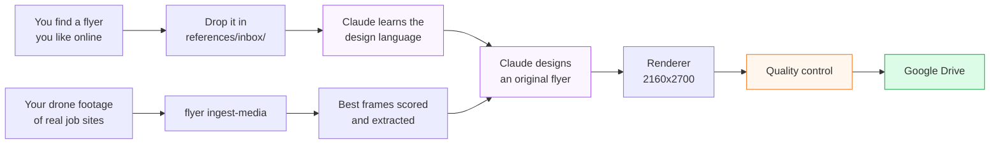

<div align="center">

# Flyer Generator

**Turn drone footage of your job sites into professional construction flyers.**

You supply the inspiration and the photos. Claude does the repetitive production.

[](https://github.com/engineeringwithjp/flyer-generator/actions/workflows/tests.yml)
[](https://github.com/engineeringwithjp/flyer-generator/actions/workflows/generate-flyers.yml)
[](https://www.python.org/)
[](tests/)
[](LICENSE)

</div>

---

## What it does, in one picture



**It recreates the *style* of flyers you admire, using *your* photos, with
*your* branding.** It never copies the advert itself.

> **New to the terminal?** Read **[GETTING-STARTED.md](GETTING-STARTED.md)**
> first. It assumes nothing.

---

## The three things you do

### 1. Show it what you like

Save any flyer you'd want yours to resemble, then:

```bash
cp ~/Downloads/nice-roofing-ad.jpg references/inbox/
flyer ingest-reference
```

Claude studies it — layout, hierarchy, where the headline sits, how the photo
is treated, where the CTA goes — and files it with structured metadata. It
records **design DNA**, never the advertiser's name, wording, logo or offer.

```bash
flyer list-references              # what it has learned
flyer promote ref_000001 approved  # this one is a keeper
```

Approved references carry the most weight. Rejected ones are never used.

### 2. Give it your photos

Plug in the drone card:

```bash
flyer ingest-media /Volumes/Untitled/DCIM/101MEDIA
```

It watches every clip, samples frames, scores each one for flyer suitability,
throws away near-duplicates, and saves the best at full resolution.

*A real run on this project: **135 videos → 540 frames sampled → 132 kept**, in
about twelve minutes.*

Then approve what you want used:

```bash
flyer assets                    # ranked list of what is waiting
flyer assets --promote-top 10   # approve the best ten
```

### 3. Make flyers

```bash
flyer generate                    # today's two
flyer generate --count 1 --campaign siding --message "built-in insulation"
```

---

## On demand, or on a timer

Both. It is the **same pipeline** either way — there is deliberately only one
generation code path.

### On demand

```bash
flyer generate
```

Or from GitHub: **Actions → Generate flyers → Run workflow**. That form takes
client, count, campaign, message, CTA and connector overrides.

### On a timer

Out of the box it runs **10:07 AM, Monday to Friday**, and puts two flyers in
Google Drive.

To run **every 3 hours** instead, set three repository variables
(Settings → Secrets and variables → Actions → *Variables*):

| Variable | Value |
| --- | --- |
| `SCHEDULE_MODE` | `interval` |
| `SCHEDULE_INTERVAL_HOURS` | `3` |
| `SCHEDULE_WINDOW` | `08:00-20:00` |

…then uncomment the hourly `cron` line in
`.github/workflows/generate-flyers.yml` (it is marked with instructions).

That gives runs at **8am, 11am, 2pm, 5pm and 8pm** local. Check it before
committing:

```bash
SCHEDULE_MODE=interval flyer schedule-check
```

```
Timezone   America/New_York
Now        2026-09-06 14:00 EDT
Schedule   every 3h within 08:00-20:00 on mon-fri
Should run yes  (on a 3h slot inside 08:00-20:00)
```

<details>
<summary><b>Why hourly cron, and a word of caution on 3 hours</b></summary>

GitHub Actions cron is **UTC only** and has no timezone support, so "10:07 in
New Jersey" is two different UTC times across the year. The workflow therefore
fires generously and `flyer schedule-check` makes the real decision in your
timezone. A run outside a slot exits in about 20 seconds.

**The caution:** every 3 hours at 2 flyers a run is **10 flyers a day, ~2,600 a
year, for one client.** Two problems with that:

1. **Instagram and Facebook will punish it.** Ten posts a day reads as spam.
2. **The variety rules will strain.** The catalogue has 37 campaigns and the
   system refuses to repeat one within 10 days. At 10 a day it runs out.

If what you actually want is *a bank of flyers to pick from*, interval mode is
a good fit — generate through the day, post the best one or two. If you want
*what gets posted*, two a day is the right number and the default already does
it.

A middle setting many people land on: `SCHEDULE_INTERVAL_HOURS=6`,
`SCHEDULE_WINDOW=09:00-15:00` — two runs a day, morning and afternoon.

</details>

---

## What comes out

The house style, extracted from the reference flyers supplied for this project:

- Real drone photography, **full bleed**, filling the whole canvas
- One **oversized headline** running nearly edge to edge
- **Exactly one word in red** (`#DC1F26`)
- A **red pill** under the headline carrying the supporting line
- A row of **translucent chips** for the proof points
- Contact line **bottom-left**, company mark opposite
- **No large colour panels.** The photograph is never boxed in

The website's maroon and gold are deliberately *not* used. A website palette on
a flyer reads as a corporate template.

### Six layouts, five type pairings

`hero-editorial` (the default) · `hero-full` · `banner-lower-third` ·
`split-diagonal` · `offer-badge` · `before-after` · `stat-stack`

Two flyers a weekday is about 500 a year, so the real risk is not one bad flyer
but 500 identical ones. It varies layout, type pairing, campaign, angle,
overlay, crop and CTA — and refuses to repeat a campaign within 10 days.

---

## The part that protects you

**It cannot invent a claim.** No discount, statistic, warranty, certification,
award or licence number appears unless it is written in
`clients/all-elite/client.json`. Today it may say only these:

```
Licensed & insured New Jersey contractor
NJ HIC #13VH12314700
GAF Master Elite contractor
25+ years of experience
2,500+ customers served
50-year GAF Master Elite warranty available
```

**It cannot use a fake photo.** Every image carries provenance, and only real,
approved media can reach a flyer:

```
client_photo  100  ┐
client_drone   95  ├─ real, and approved by you
client_frame   90  ┘
internal       70
stock          45
generated       5  ┐ never production, whatever anyone marks them
placeholder     0  ┘
```

This is enforced in the data model itself: marking a synthetic image "approved"
silently downgrades it. A generated picture of a beautiful roof can never be
presented to a homeowner as your work.

**Nothing that fails QA reaches Drive.** Flyers render into a local staging
folder and a separate step promotes only what passed. Thirty-plus automatic
checks: dimensions, blank renders, clipped text, placeholder text, em dashes,
emoji, generic AI filler, unverified numbers, unauthorised offers, risky
insurance claims ("free roof", "guaranteed approval") that get contractors
reported — plus two that came from flyers which shipped looking broken:

* **copy drawn over copy.** The renderer records where every block of text
  lands and compares them. Two layouts were printing the CTA button on top of
  the body copy, and every pixel-level check passed them.
* **type that does not read.** Contrast is sampled across the box the text will
  occupy, not averaged — a busy aerial averages to a comfortable mid-grey while
  half of it is bright sky. Headlines are held to 3:1, small copy to 4.5:1.

**Before/after needs a person.** Pairs are matched by project, but two folders
both named `bergenfield` turned out to hold two different houses, so a matching
label is not proof. A comparison flyer does not ship until `pair_confirmed` is
set by hand.

**A photograph can be held for reasons no check can see.** Put the reason in
`provenance.hold_reason` — "worker at the roof edge with no visible harness" —
and the asset stops being production-eligible.

See **[QUALITY-GATE.md](QUALITY-GATE.md)** for the full list and why each rule
exists.

---

## Every command

```bash
# Making flyers
flyer generate                                    # today's two
flyer generate --count 1 --campaign roofing       # one, forced campaign
flyer generate --message "built-in insulation"    # steer the message
flyer generate --cta "Book Your Inspection"       # override the CTA
flyer generate --no-upload                        # skip Google Drive

# Your photos and video
flyer ingest-media /Volumes/Untitled/DCIM/101MEDIA
flyer ingest-media <path> --project bergenfield --per-video 2
flyer assets                                      # what is awaiting review
flyer assets --promote-top 10                     # approve the best
flyer assets --reject <id>                        # never offer again
flyer catalog                                     # rebuild the photo index

# Design references
flyer ingest-reference                            # analyse references/inbox/
flyer promote ref_000001 approved
flyer list-references --status approved

# Feedback
flyer feedback <flyer_id> approve
flyer feedback <flyer_id> reject --reason "headline too small"
flyer history --limit 20

# Delivering
flyer generate --no-upload                        # stage locally, look first
flyer deliver                                     # promote what passed to Drive

# Checking things
flyer validate                                    # config, clients, libraries
flyer coverage                                    # which services have photography
flyer schedule-check                              # is now a run slot?
flyer layouts                                     # the seven layouts
flyer design-system                               # the compiled rules
flyer connectors                                  # external tool status
flyer distill                                     # prompts -> design rules
```

---

## Setting it up

```bash
git clone https://github.com/engineeringwithjp/flyer-generator.git
cd flyer-generator
./scripts/dev.sh install
./scripts/dev.sh preview        # two flyers, no API key needed
```

`./scripts/dev.sh preview` works with **no credentials and no photos** — procedural
backgrounds and a deliberately conservative copywriter that cannot make a
claim. Then add `ANTHROPIC_API_KEY` to `.env` for real copy and art direction.

For the 10:07 automation you need five GitHub secrets. Full walkthrough:
**[docs/SETUP.md](SETUP.md)**.

---

## Adding another contractor

A folder and a JSON file. No code changes — there is a test asserting exactly
that.

```bash
cp -r clients/_template clients/second-co
# edit clients/second-co/client.json
flyer generate --client second-co --count 2
```

---

## Status

| | |
|:--|:--|
| ✅ Working | Flyer generation, 7 layouts, media ingestion, provenance gate, review workflow, reference library, QA, campaign memory, multi-client, scheduling, 337 tests |
| ⚙️ Needs your credentials | Claude API, Google Drive upload, reference ingestion (all code-complete and mocked-tested) |
| 🔌 Not verified | Unsplash, Figma, Canva, Mobbin. Adapters and fallbacks built; **never actually called** |
| 📋 Planned | Social publishing, engagement feedback, web dashboard |

---

## Documentation

| | |
|:--|:--|
| **[GETTING-STARTED.md](GETTING-STARTED.md)** | **Never used a terminal? Start here** |
| [docs/SETUP.md](SETUP.md) | Local → Claude → full automation |
| [docs/TESTING.md](TESTING.md) | Four levels of verification |
| [docs/QUALITY-GATE.md](QUALITY-GATE.md) | What blocks a flyer, and why |
| [docs/VERSIONING.md](VERSIONING.md) | Tags, branches, rollback |
| [design-system/CONFLICTS.md](design-system/CONFLICTS.md) | Contradictions, resolved explicitly |
| [CONTRIBUTING.md](CONTRIBUTING.md) · [SECURITY.md](SECURITY.md) | Conventions · secrets and privacy |

---

<div align="center">

**MIT** · Built for **All Elite Roofing & Siding**, New Jersey

*You manage the taste. Claude manages the repetitive production.*

</div>
